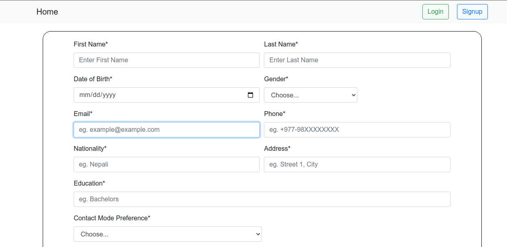

# User Profile

Custom User profile with django's abstract user and custom fields.

### Overview

---

User Profile is a powerful and flexible toolkit for building user profiles.

This Project uses a reusable app `custom-user-profile`, which consists of the core logic of this project. Full documentaion of the reusable app is [here](https://github.com/anjaan-g/custom-user-profile)

### Requirements

-   Python 3.7+
-   Django 4.2, 4.1, 4.0, 3.2

We highly recommend and only support the latest patch release of each Python and Django series.

## Running the Project

Prequisite: Docker installed in the machine.

1. Clone this project with `git clone https://github.com/anjaan-g/technical-assessment-python.git`
2. This project uses environment variables for secret_key, debug, environmentso create a `.env` file inside the src directory and add the variables in following fashion.

```python
# .env

SECRET_KEY='Your_secret_key'
ENVIRONMENT=LOCAL
DEBUG=True
```

3. Open up your terminal and run `docker-compose up -d --build`. This will install required dependencies from `requirements.txt` and run the server on localhost port 8000.
4. If for some reason, you get errors with dependencies with docker, run `docker-compose build --no-cache` this will build the docker container fresh.
5. Go to `http://localhost:8000` and You'll see the project running.

# Demo

Home page for unauthenticated user will look like this:


New User Registration Page


Login Page:


Users Listing for admin users:


Users Detail View:

